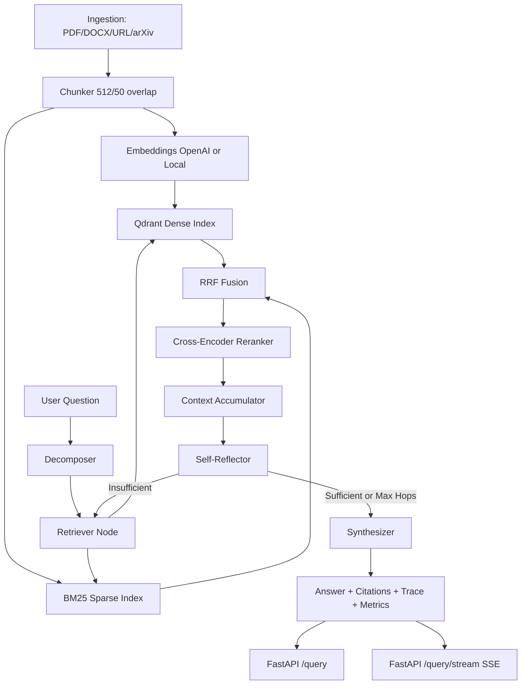

# ResearchGraph-RAG: Multi-Hop Scientific RAG with Evaluation

ResearchGraph-RAG is a production-style retrieval-augmented generation system for **complex scientific multi-hop QA**, not a simple single-pass PDF chatbot.

It combines:
- multi-source ingestion (PDF, DOCX, URL, arXiv)
- hybrid retrieval (dense Qdrant + sparse BM25)
- persisted sparse index state for API restarts
- reciprocal-rank fusion and cross-encoder reranking
- multi-hop agentic reasoning with query decomposition and self-reflection
- citation-grounded synthesis
- API + live step streaming + evaluation + ablations

## Why This Is Not a Simple Chatbot

A basic chatbot retrieves once and answers once. This system:
- decomposes hard questions into sub-queries
- iteratively retrieves and reflects across hops
- re-queries when evidence is insufficient
- enforces citation-backed factual claims
- logs latency and token usage
- supports evaluation and ablation for scientific rigor

## Architecture



## Repository Structure

```text
researchgraph-rag/
├── ingestion/
├── retrieval/
├── agent/
├── api/
├── evaluation/
├── scripts/
├── tests/
├── docker-compose.yml
├── Dockerfile
├── requirements.txt
├── .env.example
├── config.py
├── README.md
└── Makefile
```

## Setup

1. Create environment and install dependencies:
```bash
python -m venv .venv
source .venv/bin/activate
pip install -r requirements.txt
```

2. Copy configuration:
```bash
cp .env.example .env
```

3. Start Qdrant + API:
```bash
docker compose up --build
```

Or run API locally (with Qdrant already running):
```bash
uvicorn api.main:app --reload
```

## Ingest Documents

### API ingestion options
- PDF upload
- DOCX upload
- URL
- arXiv ID

Example:
```bash
curl -X POST http://localhost:8000/ingest -F "url=https://arxiv.org/abs/1706.03762"
```

## Ask Questions

```bash
curl -X POST http://localhost:8000/query \
  -H "Content-Type: application/json" \
  -d '{"question":"Compare transformer-based and CNN-based models for retinal disease classification and discuss explainability trade-offs."}'
```

### Streaming reasoning
```bash
curl -N -X POST http://localhost:8000/query/stream \
  -H "Content-Type: application/json" \
  -d '{"question":"How do foundation models compare with task-specific genomics models for variant interpretation?"}'
```

The streaming endpoint emits `start`, `reasoning_step`, `final_answer`, and `done` events as the agent progresses through decomposition, retrieval, reflection, and synthesis.

## Example Multi-Hop Output (shape)

```json
{
  "answer": "Transformers improved long-range feature modeling in retinal OCT studies [3f4c...], while CNN baselines remained competitive on smaller datasets [91a2...].",
  "citations": [
    {
      "chunk_id": "3f4c...",
      "source_doc": "retina_paper.pdf",
      "page": 5,
      "section": "Results",
      "excerpt": "..."
    }
  ],
  "reasoning_trace": [
    {"step":"decompose","sub_queries":["...", "..."]},
    {"step":"retrieve","query":"...","retrieved":5,"new_chunks_added":4},
    {"step":"reflect","hop":1,"sufficient":false,"follow_up_query":"..."},
    {"step":"synthesize","cited_chunks":["..."]}
  ]
}
```

## Evaluation Methodology

`evaluation/` includes:
- synthetic test-set generation from ingested chunks
- fallback custom metrics:
  - citation coverage
  - retrieved context overlap
  - answer length
  - cited claim count
  - unsupported-claim detector placeholder

If RAGAs is available in your environment, you can extend `evaluation/metrics.py` with faithfulness/relevancy/context metrics.

## Ablation Experiments

Compare:
- dense-only vs hybrid retrieval
- hybrid without reranker vs hybrid with reranker
- 1-hop vs multi-hop

Export:
- JSON summary
- Markdown table for README/reports

### Placeholder table

| Variant | Metric | Value |
|---|---:|---:|
| dense_only | avg_citation_coverage | TBD |
| hybrid_no_rerank | avg_citation_coverage | TBD |
| hybrid_rerank | avg_citation_coverage | TBD |
| multi_hop | avg_citation_coverage | TBD |

## Design Decisions

- **LangGraph**: explicit state transitions, inspectable reasoning graph, controlled multi-hop behavior.
- **Hybrid retrieval**: dense semantic recall + BM25 lexical precision reduces blind spots.
- **Reranking**: cross-encoder boosts top-context relevance before synthesis.
- **Self-reflection**: avoids premature synthesis when evidence is weak.
- **Evaluation-first framing**: supports reproducibility and engineering credibility.

## Tests

Run:
```bash
pytest -q
```

Current tests cover:
- chunking behavior
- BM25 retrieval
- RRF hybrid fusion
- reranking wrapper
- citation metrics
- FastAPI health endpoint
- agent state transitions

## Future Improvements

- introduce explicit claim-level verifier (NLI) for unsupported claim detection
- add optional graph-of-papers citation traversal
- add MLflow tracing for retrieval/hop-level diagnostics
- add authenticated multi-tenant document collections
- add CI pipeline for benchmark regression checks
